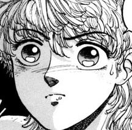

# Guia 
Algumas imagens podem parecer confusas e ambíguas, então tente escolher a expressão mais próxima possível da face mostrada. Abaixo temos alguns exemplos de faces e as expressões que consideramos:

#### **Surpresa:**

Nessa imagem os olhos arregalados e a gotinha na cara são indicadores de surpresa comuns.

#### **Seriedade:**

São expressões bem comuns que vão de uma faces neutras até expressões de leve raiva para alguns.

#### **Felicidade:**

Podem ser bem ambiguas, mas geralmente a presença de um sorriso é o suficiente para classifica-la como tal.

#### **Não se sabe:**

Imagens onde não podemos ver a face claramente para inferir que expressão o personagem faz.

